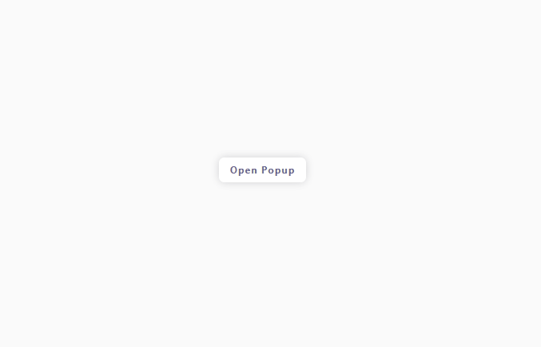

# Morabaa Provider
Morabaa Provider is a versatile library for creating and managing customizable popups in your React applications. It offers a simple API and various configuration options to make your popups look and behave just the way you want.

## Installation
You can easily install Morabaa Provider via npm or yarn:
```bash
npm install morabaa-provider
# or
yarn add morabaa-provider

```
## Quick Start
Set up the ProviderContainer component in your main application file (e.g., App.js or App.tsx):
```jsx
import "./App.css"
import { ProviderContainer } from 'morabaa-provider';

const App = () => {
  return (
    <>
      {/* Your app code... */}
      <ProviderContainer />
    </>
  );
};

export default App;
```
Create file in your project directory and name it PopupExample.js or PopupExample.tsx and add this code to it:

```jsx
import React from "react";
import { PopupMe } from 'morabaa-provider';

const PopupExample = () => {
  return (
    <div className="col" style={{ margin: "auto" }}>
      <p className="button" onClick={() => PopupMe(<PopupChild />)}>
        Open Popup
      </p>
    </div>
  );
};

export default PopupExample;

const PopupChild = () => {
  return (
    <div className="col">
      <p className="text-red"> Hello World </p>
    </div>
  );
};

```

Finally, include the PopupExample component in your main application file to see the result:

```jsx
import "./App.css"
import React from "react";
import { ProviderContainer } from 'morabaa-provider';
import PopupExample from "./PopupExample";

const App = () => {
  return (
    <>
      {/* Your app code... */}
      <ProviderContainer childClass="child-class" overlayClass="overlay-class" />
      <PopupExample />
    </>
  );
};

export default App;
```

The result should be like this:



## Features

- Create popups with custom content.
- Customize popup options including animations.
- Easily integrate popups into your React application.

## License

This library is licensed under the MIT License - see the [LICENSE](LICENSE) file for details.

## Authors

[Owl](https://github.com/Owl3CM) 

## Related Projects

- [Morabaa Utils](https://github.com/MorabaaSoftwareSolutions/Morabaa-Utils)

## Support

If you have any questions or need assistance, please reach out to [
  <!-- dirct him to my gmail is saochiha@gmail.com -->
Owl](mailto:owl7cm@gmail.com) or open an issue on GitHub.
